Getting Started
===============
This Getting Started guide aims to get you using the
Hotmaps-Dispatch-Application as quickly as possible

Workflow
--------
3.  Select a heat demand profile in the [Heat Demand – Tab](#heat-demand-tab) or
    upload your own profile via the [Load Individual Data
    -Tab](#load-individual-data-tab)
4.  Set the yearly heat consumption of your region in the [Heat Demand –
    Tab](#heat-demand-tab) or in the [Paramters- Tab](#parameters-tab), by
    editing the Total Demand [MWh] input widget
5.  Add predefined [heat generators](#hg_add) or [heat storages](#hs_add) in the [Heat Producers and
    Heat Storage - Tab](#heat-producers-and-heat-storage-tab) by pressing the
    **+** Button or [upload](#upload) custom generators via the Upload Power Plant
    Parameters – Button
6.  Set various prices, parameters, profiles, etc. or upload your own data and
    click on the Run Dispatch Model - Button
7.  After 60 to 120 seconds the results are shown in the output section

Things to consider
------------------
-   Refreshing the page deletes all your progress
-   Always save your progress by [downloading](#download) the created structure
-   After calculation is done [download](#calc_done) the result files
-   [Copy the link of the results](#calc_done) if something occurs you can
    access your results within 2 hours (this saves you time)
-   If you upload your own data, pay attention to the needed structure as
    described [here](#format) and [here](#upload_extern)
-   Look up the heat [generator types](#types) that are available when
    generating your custom structure outside the Application
-   Don’t forget to press the ✓ - Button in the [Sale-/Electricity Price
    Tab](#electricity-price-sale-electricity-price-tab), because only so changes
    take effect
-   If the page doesn’t respond for a long time or something else happened
    refresh the page and try again, if the issue is still present look up the
    [User Guide](#user-guide), if you have still the issue please document all
    setting you set (which browser, parameters, data, etc. did you use)
-   At last but not least, be patient…

User Guide
==========
The User Guide is the primary resource for documenting key concepts that will
help you use the Hotmaps-Dispatch-Application in your work

The Web User Interface
----------------------
The figure below shows the User Interface. At first glance, you can see that the
Application is divided into four sections:
1.  Button Section
2.  Notification Section with Peak Load and Missing Capacities – Information
3.  Output Section
4.  Data Section

In the following chapters, each section is described in detail.

Button Section
--------------

### Short Description:
-   In this Section, you can download the created structure to save your
    progress,
-   You can upload your saved progress, or a custom structure into the
    Application,
-   You can run the model you created,
-   You can reset the view for better workflow or
-   You can start an investment model

### Long Description:

#### Download 
By pressing this button, the browser will try to download a file with the name
*download_input.xlsx* that contains all the Information regarding heat producers
and heat storages.
**The downloaded file has the following format (for uploading the same format
must be specified):**
It has five worksheets:

##### Worksheets 
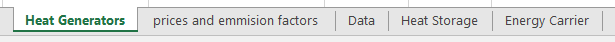

**The worksheets have following structure (columns):**

- **Heat Generators:**

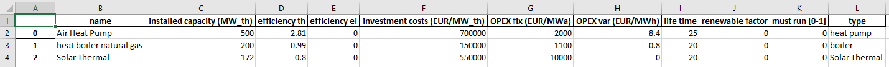

- **prices and emission factors:**

- **Data:**

- **Heat Storage:**

- **Energy Carrier:**

#### Upload 
By clicking this button, a pop up window will open and you will be able to
upload a xlsx file. That overwrites the content of the web user interface.
The file you upload **must** have the structure as described [before](#format)
in the long description of the download powerplant parameters -Button.

***Consider following:***
* You have to create a file that has the same names for the [worksheets](#worksheets) and columns
* The worksheet names are case sensitive
* The column names are case sensitive
* You must specify an index column starting with 0
* You can create maximum 13 energy carriers

***Following heat generator types are available (type column in the [Heat Generators](#HeatGenerators) worksheet)***

| *name available (case sensitive)* | *Description*                                                       | *Implementation Note*                                                     |
|-----------------------------------|---------------------------------------------------------------------|---------------------------------------------------------------------------|
| *CHP-BP*                          | Back Pressure CHP                                                   |                                                                           |
| *CHP-SE*                          | Steam Extraction CHP                                                |                                                                           |
| *boiler*                          | heat boiler                                                         |                                                                           |
| *heat pump*                       | heat pump                                                           | For temperatures < 0°C the heat pump doesn’t work                        |
| *Solar Thermal*                   | Solar thermal plant                                                 |  |
| *Waste treatment*                 | waste incineration plants                                           |                                                                           |
| *Waste Heat\**                    | Power plants that work with the unused heat from other power plants |                                                                           |
| *Geo Thermal\**                   | Geo thermal power plant                                             |                                                                           |
| *Power To Heat\**                 | Power to heat devices                                               |                                                                           |

#### Run 
By Pressing this button, the optimization will start. You will get a progress
shown in the notification section.
Depending on the structure you create the optimization will run for about 60 to
120 seconds.
Please be aware that your browser might freeze at that time.
After the solution is found the results are shown in the output section. You can
download then the results via the [buttons](#calc_done) in the [notification
section.](#info_after_run) Also, if something gets wrong you will get
information in the notification section.
If unexpected errors occur please document and send detailed instruction to
reproduce the error and send these instruction with a short problem description.

#### Reset 
By pressing this button, the notification section and the output section will be
cleared, and you will get a “fresh” view.

#### Invest 
The Application is implemented as a linear program and can be used on the one
hand as a pure dispatch model and on the other hand for investment planning (how
much capacities to install) to cover a load profile with the minimum costs.
If you enable this toggle button, it is important to specify the heat producers
and heat storages by marking them (hold CTRL and left mouse click to select the
desired generators and storages) for which an investment model should run.

Notification Section with Peak Load and Missing Capacities – Information
------------------------------------------------------------------------

#### Short Description:
In this section, you will get information regarding the progress, the peak load,
missing capacities and errors that occur.

#### Long Description:
In the following you will see some frequent messages (progress and error
information) that might appear in the notification section.

##### After pressing the [Run Dispatch Model Button](#run) 

- **Dispatch in progress, please be patient…**
This can take some time. Typically, also to browser can freeze when the
calculation is done and the results are rendered in the browser

- **Calculation is Done**
With these buttons, you can download your results. It might happen that the
page freezes after downloading, please be patient. We recommend also to save the
link of these file right click on the buttons Copy Link (after 2 hours this
links will not work but you can download the files directly if the page freeze
and so save so your time)

- **No Heat Generators available**
This will happen if you haven’t specified any heat generators and wanted to
start the model from the initial page.

- **The installed capacities are not enough to cover the load**
This will be shown when you haven’t specified enough MW to cover the peak load
(see missing Capacities in the right sight of the notification section)

- **Error: Problem proven to be infeasible or unbounded**
This happens typically when constraints cannot be met and can have a lot of
reasons, its upon you to think about what could happen.

- **Error: Please specify the technologies for the investment model**
This is shown when you enable investment planning but you forgot to select the
heat generators and heat storages to mark, with whom it should do an investment
optimization

##### After Pressing the [Download Button](#download)

- **Nothing to download**
Typically, this occurs when you want to download the initial page, to download
you need to [add](#add-new-heat-generator-section) first a heat generator

- **Download done**
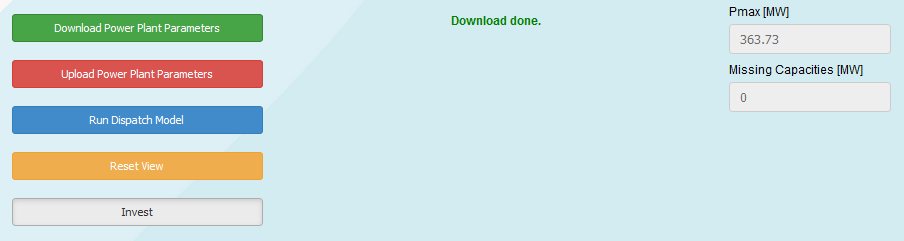

##### After Pressing the [Upload Button](#upload)

- **Not a valid file to upload**
This is shown when you try to upload an filetype other then .xlsx

- **Fatal Error \@ Update**
This is shown when your file you want to upload has not the needed
[structure](#format).

- **Upload Done**

##### After Pressing the [Invest Button](#invest)

- **Mark Technologies by pressing “CTRL” + “left mouse” Rows are marked yellow**
As soon as you press the Invest Button you will see this Information in the
notification section, it tells you that you need to specify for which generators
and storages to do the investment planning. If you don’t mark technologies you
will get the message as described [here](#specify)

##### After Pressing the + Button in the [Heat Producers and Heat Storage Tab](#heat-producers-and-heat-storage-tab)

- This waiting spinner is especially visible after pressing the + Button, typically
the browser freezes, so be patient, the [add](#add-new-heat-generator-section) section is loading
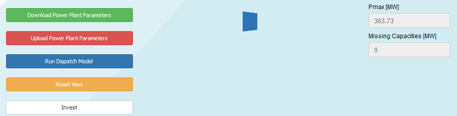

##### After Pressing the ✓ ADD Button in the [Heat Generator Adding Section](#add-new-heat-generator-section)

- **Heat Generator ADDED**

##### After Pressing the ✓ - Button in the [Sale-/Electricity Price Tab](#electricity-price-sale-electricity-price-tab)

- **Sale-/Electricity price Data is set as Default**

- **Sale-/Electricity price Data for Heat Generator *name* is added**

##### After Uploading a file in the [Load Individual Data Tab](#load-individual-data-tab)

- **Invalid Filetyp to load \@ Loading External Data**
This is shown when you try to upload a filetype that is not .xlsx or .csv

- **Your file has not enough values (please specify 8760 values)**
Your file that you upload has to have the structure as described
[here](#upload_extern)

- **External Data Loaded**
This is shown when the external Data has been [uploaded](#succes_extern).

##### After Pressing the ✓ Save Button in the [Load Individual Data –Tab](#load-individual-data-tab)

- **External Data *name* added to Profile as *name_1***
This is shown after adding a custom data to the profiles as described
[here](#saving_tools)
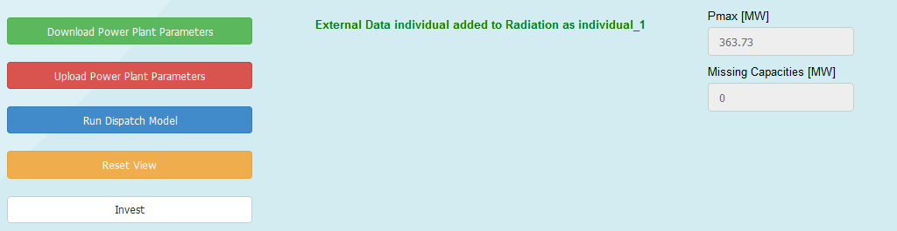

- **n_th/COP - External Data added to Heat Generator name**
This is shown after adding a custom data for the thermal efficiency to a heat
generator as described [here](#saving_tools2)

Output Section
--------------

#### Short Description:

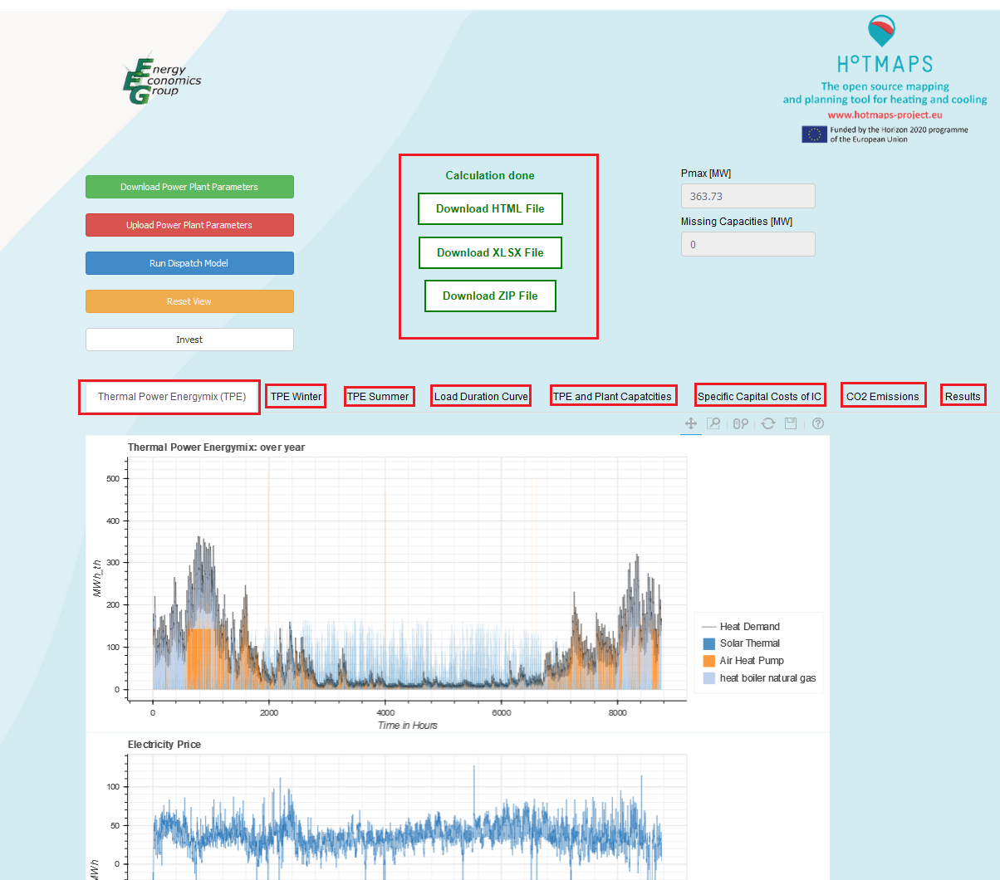

#### Long Description:

Data Section
------------

### Heat Producers and Heat Storage – Tab

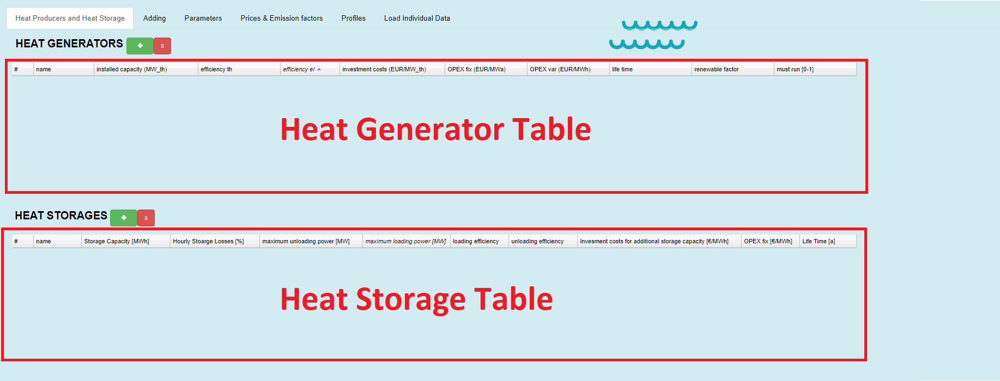

#### Short Description:

In this Tab, the [created](#add-new-heat-generator-section) or [uploaded](#upload) heat generator
and heat storage data is shown in two tables (heat storage table and heat
generator table). The above picture shows the initial page (no heat generators and no heat storages are defined).

Please notice that it is possible to edit the values in the tables.

By pressing the *+* Button you will be navigated to the [Adding Tab](#add-new-heat-generator-section), for adding new heat
generators or [heat storages](#add-new-heat-generator-section2), pops up between the button section and the output section (see
picture below) *\**.

- **Section After Pressing *+* Button in the [Heat Generator Table](#heat-generator-table)**

- **Section After Pressing *+* Button in the [Heat Storage Table](#heat-storage-table)**

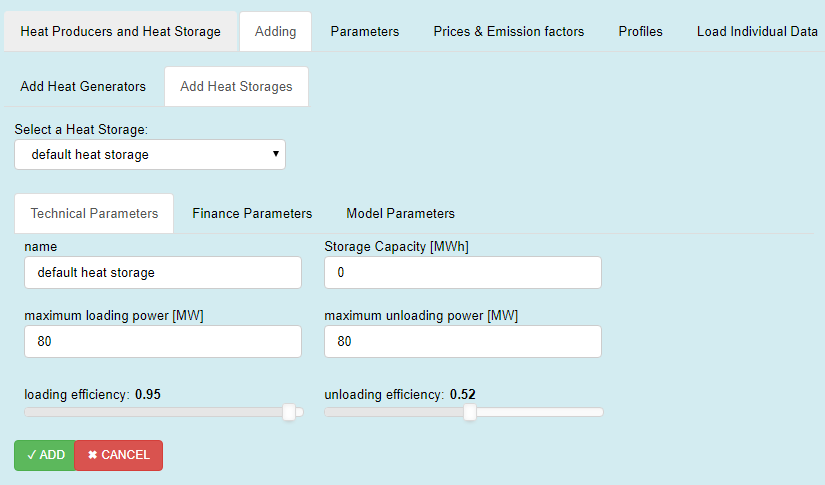

#### Long Description:

##### Heat Generator Table

Your [added](#add-new-heat-generator-section) (by pressing the **+** Button) or [uploaded
data](#upload) of heat generators is shown here. You have the opportunity to
change the values of the table \*.

These parameters can also be changed via [uploading](#upload). Therefor you have
to create an excel sheet with the structure as described [here](#format). Then
the parameters must be specified in the [Heat Generators worksheet](#HeatGenerators).

**Format, unit and description of the Heat Generators Table**

| **Column name**              | **Format**                          | **Unit**              | **Description**                                                                                                                                                                                                                                                                                                                                                                                                                                                                                                                                                                            |
|------------------------------|-------------------------------------|-----------------------|--------------------------------------------------------------------------------------------------------------------------------------------------------------------------------------------------------------------------------------------------------------------------------------------------------------------------------------------------------------------------------------------------------------------------------------------------------------------------------------------------------------------------------------------------------------------------------------------|
| name                         | String                              | \-                    | Name of your power plant, you can give any name you want (don’t use to same names for different generators)                                                                                                                                                                                                                                                                                                                                                                                                                                                                                |
| installed capacity (MW_th)   | Number                              | MW                    | Here you can specify the power you want to install                                                                                                                                                                                                                                                                                                                                                                                                                                                                                                                                         |
| efficiency th                | Number                              | \-                    | Here you can specify the thermal efficiency of the heat generator                                                                                                                                                                                                                                                                                                                                                                                                                                                                                                                          |
| efficiency el                | Number $$\mathbb{R}$$ $$\vee$$[0,1] | \-                    | Here you can specify the electrical efficiency of the heat generator                                                                                                                                                                                                                                                                                                                                                                                                                                                                                                                       |
| investment costs (EUR/MW_th) | Number                              | \\frac{}{\\text{MW}}  | Here you can set the specific investment cost (especially if you try to do [investment planning](#invest), this parameter can be crucial)                                                                                                                                                                                                                                                                                                                                                                                                                                                  |
| OPEX fix (EUR/MWa)           | Number                              | \\frac{}{\\text{MW}}  | Here you can specify fixed operational expenditures                                                                                                                                                                                                                                                                                                                                                                                                                                                                                                                                        |
| OPEX var (EUR/MWh)           | Number                              | \\frac{}{\\text{MWh}} | Here you can specify variable operational expenditures                                                                                                                                                                                                                                                                                                                                                                                                                                                                                                                                     |
| life time                    | Number                              | a                     | Here you can set the life time of your generator (in the model this is used for the annuity factor)                                                                                                                                                                                                                                                                                                                                                                                                                                                                                        |
| renewable factor             | Number $$\mathbb{R}$$ $$\vee$$[0,1] | \-                    | Here you can set the renewable share of your generator, e.g. if your generator is 0% renewable ten you set 0, if your generator is 50% renewable then you have to set this value to 0.5. The Application tries then to meet the minimum renewable share (specified in the [Parameter Tab](#parameters-tab)) for the generation mix. Caution: the problem might become infeasible, e.g. if you defined a minimum share of 50% but you haven’t defined enough generators with a renewable factor higher than 0.5 the constraint for a minimum share of 50% cannot be met                     |
| must run [0-1]               | Number $$\mathbb{R}$$ $$\vee$$[0,1] | \-                    | Here you can force a heat generator to run all the time with x% of its installed capacity, if you want to realize a base load you can use this as a parameter, e.g. if you want that your het generator run with 50% of its capacity all the time you have to set this value to 0.5. Caution: Due to other constraints, the problem might become infeasible, e.g. the heat pump doesn’t run at temperatures lower than 0°C, that means if you force a heat pump to run all the time with x% of its capacity the other constraint cannot be met and therefore the problem become infeasible |

\*Caution: In this table, it is not possible to change the heat generators
[type](#types) or [energy carrier](#energy_carrier). The type is either defined
by the [type column](#HeatGenerators) in the [Heat Generator](#worksheets)s
worksheet when uploading power plant parameters or internally by adding from the
user interface in the [Add new Heat Generator Section](#types_2). The same
applies for the energy carriers, they can only be adapted via uploading an excel
file ([energy carrier](#energy_carrier) worksheet) or via the internal [adding
section](#tec_param).

##### Heat Storage Table

You have the opportunity to change the values of the table \*. These parameters
can also be changed via [uploading](#upload). Therefor you have to create an
excel sheet with the structure as described [here](#format). Then the parameters
must be specified in the [Heat Storage worksheet](#heat_storage_worksheet).

**Format, unit and description of the Heat Storages Table**

| **Column name**                                         | **Format**                          | **Unit**              | **Description**                                                                                                                                                             |
|---------------------------------------------------------|-------------------------------------|-----------------------|-----------------------------------------------------------------------------------------------------------------------------------------------------------------------------|
| name                                                    | String                              | \-                    | Name of your heat storage, you can give any name you want (don’t use to same names for different storages)                                                                  |
| Storage Capacity [MWh]                                  | Number                              | MWh                   | Here you can specify the capacity you want to install (if you use only dispatch mode, you can see in the notification section, how much MW you need to cover the peak load) |
| maximum unloading power [MW]                            | Number                              | MW                    | Here you can specify the unloading power                                                                                                                                    |
| maximum loading power [MW]                              | Number                              | MW                    | Here you can specify the loading power                                                                                                                                      |
| loading efficiency                                      | Number $$\mathbb{R}$$ $$\vee$$[0,1] | \-                    | Loading efficiency                                                                                                                                                          |
| unloading efficiency                                    | Number $$\mathbb{R}$$ $$\vee$$[0,1] | \-                    | Unloading efficiency                                                                                                                                                        |
| Invesment costs for additional storage capacity [€/MWh] | Number                              | \\frac{}{\\text{MWh}} | Here you can set the specific investment cost (especially if you try to do [investment planning](#invest), this parameter can be crucial)                                   |
| OPEX fix [€/MWha]                                       | Number                              | \\frac{}{\\text{MWh}} | Here you can specify fixed operational expenditures                                                                                                                         |
| Life Time [a]                                           | Number                              | a                     | Here you can set the life time of your generator (in the model this is used for the annuity factor)                                                                         |

\*Caution: Please be aware that only one heat storage is available, e.g. if you
don’t upload others only this storage will be editable. The **+** Button for heat
storages does nothing, the implementation is in progress and in future this
feature will become available.

##### Add new Heat Generator Section

By pressing the + Button in the [Heat Generators Table](#heat-generator-table) the
above section pops up (please be patient this will take some time). All heat
generators have the three red marked tabs in common, only for heat pumps an
extra tab is shown (Coefficient of Performance, COP)

The picture below shows you all predefined heat generator types, that means by
selection one of these, predefined values are loaded. You can see and edit the
values in the [Technical Parameters Tab](#tec_param) and in the [Finance
Parameters Tab](#fin_param), but you can also change them in later in the [Heat
Generator Table](#heat-generator-table). (after pressing ✓ ADD )

###### Available Heat Genrators
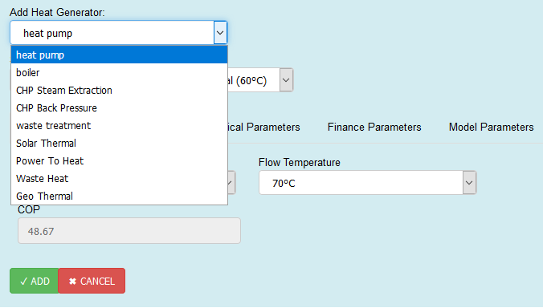

###### Available types of boilers 

###### Available types of heat pumps 

###### Available types of CHP-Steam Extraction types 
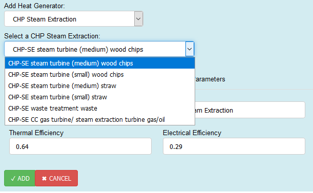

###### Available types of CHP-Back Pressure types 
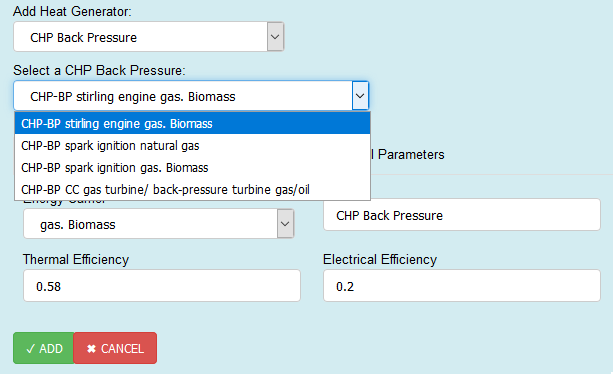

###### Technical Parameters – Tab

- 

	- Here you can select the energy carrier with witch the heat generator is fired.
You can define a name and set the thermal and electrical efficiency. For heat
pumps the input for Thermal Efficiency is disabled, because it is defined via
the [Coefficient of Performance, COP – Tab](#cop_param). Each [heat
generator](#types_2) has predefined values that are shown here. You can and
should change them.

- 

	- Here you can define the technical parameters for your heat storage

###### Finance Parameters – Tab

- 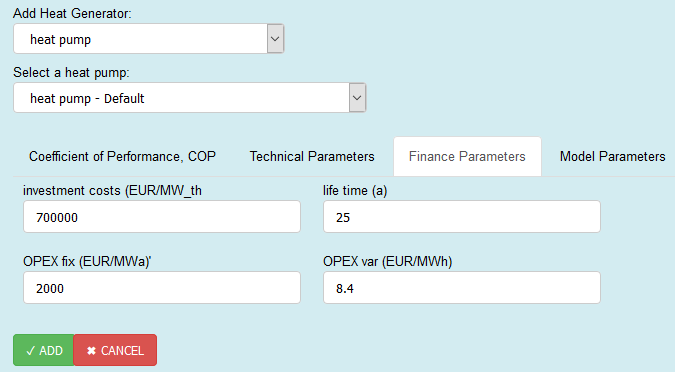

	- Here you can see and change predefined values of financial parameters for
selected heat generator.

- 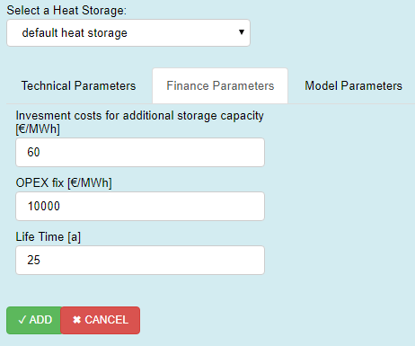

	- Here you can set the financel Paramters for your heat storage.

###### Model Parameters -Tab 

- 

	- In this Tab, you can set the orange toggle Button Must Run, that mean that this
heat generator must run all the time with 100% of its capacity (for more details
see [here](#mustRun))
With one slider, you can set a renewable factor (values from 0 to 1, more
details see [here](#renewFac)) and with the other you can set the installed
capacity of your heat generator (values from 0 to
[Pmax,](#notification-section-with-peak-load-and-missing-capacities-information)-Peak
Load of the selected Heat Profile)

- 

	- In this Tab, you can set heat storage losses, please specify losses because if losses are zero it can happen that the storage is loading and unloading at the same time

###### Coefficient of Performance, COP – Tab 

Only heat pumps have this additional tab. Here you can select an
Inlet-and-Return-Temperature and based on that selection a COP is defined. In
the [Technical Parameters Tab](#tec_param) the COP value is inserted into the
thermal efficiency input widget (the widget itself is disabled, meaning you
cannot edit the value here, but you can change it later in the [heat generators
table](#heat-generator-table) )

### Parameters – Tab

#### Short Description:
In this tab, you can change following parameters

| **Column name**                 | **Format**                          | **Unit**                     | **Description**                                                                                                                                                                                                                                                                            |
|---------------------------------|-------------------------------------|------------------------------|--------------------------------------------------------------------------------------------------------------------------------------------------------------------------------------------------------------------------------------------------------------------------------------------|
| CO2 Price [EUR/tC02]            | Number                              | \\frac{}{\\text{t\\ CO}_{2}} | CO2 Certificate Price (used for the short run marginal costs)                                                                                                                                                                                                                              |
| Interest Rate [0-1]             | Number $$\mathbb{R}$$ $$\vee$$[0,1] | \-                           | interest rate (for investment planning)                                                                                                                                                                                                                                                    |
| Minimum Renewable Factor [0-1]] | Number $$\mathbb{R}$$ $$\vee$$[0,1] | \-                           | Minimum renewable share that the thermal generation should have                                                                                                                                                                                                                            |
| Total Demand[ MWh]              | Number                              | MWh                          | Heat Consumption of one year Changing this will change the peak load (can be seen in the notification section), This cell and the Set Total Demamd (MWh) input widget in the [Heat Demand Tab](#heat-demand-tab) are coupled, this means changing one value of them changes also the other |

These parameters can also be changed via [uploading](#upload). Therefor you have
to create an excel sheet with the structure as described [here](#format). Then
the parameters must be specified in the [data worksheet](#data_worksheet).

### Prices & Emission factors – Tab

#### Short Description:

In this Tab, you can set prices and emission factors for different energy
carriers. These prices are used to calculate the short run marginal costs.

| **Column name**            | **Format** | **Unit**                                | **Description**                           |
|----------------------------|------------|-----------------------------------------|-------------------------------------------|
| energy carrier             | String     | \-                                      | Name of the energy carrier                |
| prices(EUR/MWh)            | Number     | \\frac{}{\\text{MWh}}                   | Energy carrier price                      |
| emission factor [tCO2/MWh] | Number     | \\frac{\\text{t\\ CO}_{2}}{\\text{MWh}} | CO2 emission factor of the energy carrier |

These parameters can also be changed via [uploading](#upload). Therefor you have
to create an excel sheet with the structure as described [here](#format). Then
the parameters must be specified in the [prices and emmision factors
worksheet](#ec_emf_worksheet). With the uploading method, you can create your
own energy carriers (max. 13). If you create new ones don’t forget to specify
the new names to your heat generators in the [Energy Carrier
worksheet.](#energy_carrier)

### Radiation – Tab

#### Short Description:

- In this Tab, you can select (*Country-Year* drop-down-box) a predefined or a
custom radiation profile with which you want to run the Application.

- If you have created your own profile with the [Load Individual Data -
Tab](#load-individual-data-tab) the profile will show up in *Country-Year*
drop-down-box ([Caution please](#caution)).

- The Unit of the profile is **W/m²** and the model use this profile
for the solar thermal power plants. For hours where the radiation is larger than
1000 W/m² the plant works with it peak capacities installed .

You have the opportunity to make *\*reversible* modifications on the profile:

- you can set an offset (every value of the profile will be added by the offset
value),
- you can set the whole profile to a constant value
- you can scale the profile (multiplication by a factor)
- or you can use the mean value as constant profile.

*By reversible we mean e.g. if you check the use mean value checkbox and uncheck
again you will get your profile back (see picture below), the same applies if
you set a constant value and then delete this value you will get the profile
back, see in contrast the irreversible [modification tool](#modTool_individual)
in the [Load Individual Data - Tab](#load-individual-data-tab)).

### Temperature – Tab

#### Short Description:

- In this Tab, you can select (*Country-Year* drop-down-box) a predefined or a
custom temperature profile with which you want to run the Application.

- If you have created your own profile with the [Load Individual Data -
Tab](#load-individual-data-tab) the profile will show up in *Country-Year*
drop-down-box ([Caution please](#caution)).

- The Unit of the profile is **°C** and the model use this profile for the heat
pumps. For hours where the temperature is smaller than 0°C the heat pumps
don’t work.

- You have the opportunity to make reversible modifications on the profile
(details see [here](#modTools_explain)).

### Electricity price / Sale Electricity price – Tab

*Process to assigning a sale-/or electricity price profile*

#### Short Description:

- In this Tabs, you can select (*Country-Year* drop-down-box) a predefined or a
custom sale-/electricity price profile and then assign it to a generator (*Add to*
drop-down-box) by pressing the *✓* - Button **\***.

- If you have created your own profile with the [Load Individual Data -
Tab](#load-individual-data-tab) the profile will show up in *Country-Year*
drop-down-box ([Caution please](#caution)).

- The Unit of the profile is **€/MWh** and the model uses this for
multiple purposes, e.g:

	- If the energy carrier is electricity this influences the short run marginal
costs

	- If your generator produces electricity this affects the revenues

- Also, here you have the opportunity to make reversible modifications on the
profile (details see [here](#modTools_explain)).

**\*Caution**: It is important to press the ✓ - Button, because only so changes
take effect:
e.g. Let’s say we want to change the **default** electricity price (see picture
above):
1. you select a new profile with the *Country-Year* drop-down-box
2. select Default in the *Add to* drop-down-box then
3. press the *✓* - Button,
4. then you will get an information in the notification section,

**this is the only way to assign a price profile, otherwise the initial profile or
the last set profile is used.**

### Heat Demand – Tab

#### Short Description:

- In this Tab, you can select (*Country-Year* drop-down-box) a predefined or a
custom load profile with which you want to run the Application.

- If you have created your own profile with the [Load Individual Data -
Tab](#load-individual-data-tab) the profile will show up in *Country-Year*
drop-down-box ([Caution please](#caution)).

- The Unit of the profile is **MW** and the model use this profile as the
hourly heat demand curve.

You have the opportunity to set the total heat consumption of one year. By this
you set technically the sum of all values of the profile selected.

This means if the Set Total Demand (MWh) value changes the plot will adapt so
that the sum you specified is met, also the Total Demand [MWh] value in the
[Parameters Tab](#parameters-tab) will change to the value specified (and vice
versa). Additionally, in the notification section you can see how the peak load
changes when you change the total heat consumption (see picture above).

### Load Individual Data – Tab

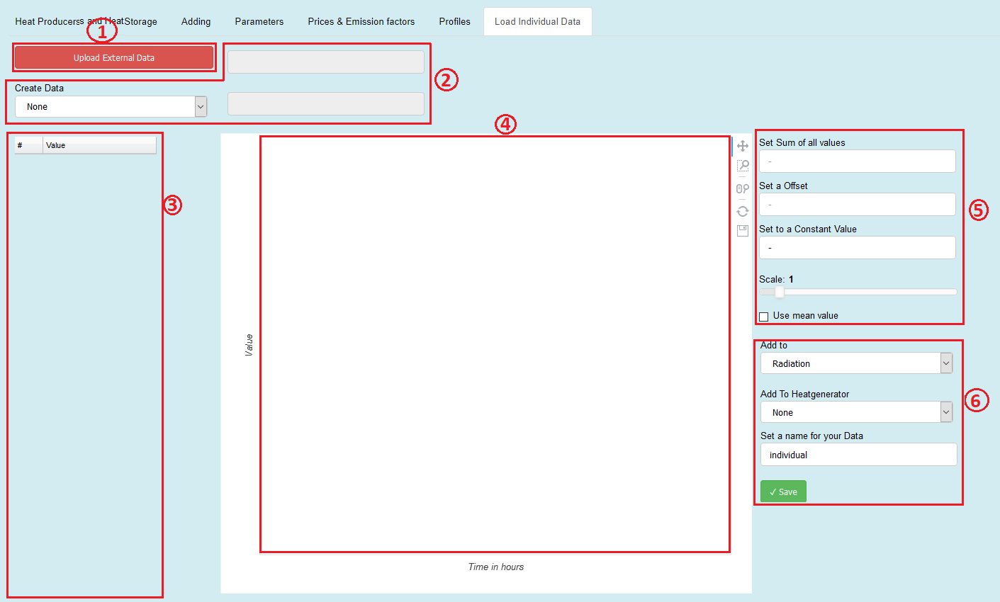

#### Short Description:

##### Upload External Data – Button

Pressing this button will enable you to upload your own data

##### Create Data – Tools

Here you can create random data. You can choose between three distributions

1. Dirichlet Distribution
2. Normal Distribution
3. Linear Distribution

##### Table

The values of the uploaded data or the created distribution are shown here. You
can also change specific values inside the table.

##### Plot Area

Here a line plot of the values from the table is shown. With the toolbar at the
right sight of the plot area you can inspect the data in more detail.

##### Modification Tools

You have the opportunity to modify the data with these tools, e.g. set the sum
of all values, set an offset, scale, etc.

##### Saving Tools

After loading your custom data, or creating a distribution you can choose for
which profile you want this dataset to be added. By Pressing the save button
your data can be found at the selected profiles and can be used by selecting it
with the name you specified.

It is also possible to add your own thermal efficiency series to heat
generators.

#### Long Description:

##### Upload External Data 
When you click on this button you will get a pop up window open, where you can
select your file with the desired values. Information regarding the progress are
shown in the notification section.
**The file you upload must have following structure:**
1. It has to be either a **.xlsx** or a **.csv** data
2. the files **must** have the **structure** as below (left: *.xlsx*, right:*csv*)
	-  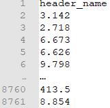
3. you have to specify **8760 values** and a **header name**
4. for *.xlsx* only the values of the **first worksheet** will be **uploaded**

An example of a successful upload can be seen in the picture below.

##### Create Data Tool 

This part of the user interface enables you to create random data. For this
purpose, following distributions are available

###### Dirichlet Distribution:

To use this distribution, you have to specify the sum\$\\text{\\:Σ}\$ - input
widget. It gives you random numbers so the sum you specify is met. An example
with sum\$\\text{\\:Σ}\$=10 is shown below.

###### Normal Distribution

Another option to create random number is the gaussian-normal-distribution. To
use this, you have to specify a mean value (sigma $$\sigma$$) and standard
deviation from that value my $$\mu$$. Below is a normal distribution with
$$\sigma = 100$$ and $$\mu = 100$$ shown.

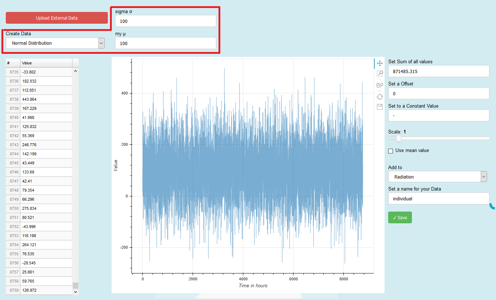

###### Linear Distribution

We this option you can create 8760 number that are linear distributed beginning
from start and ending with stop. An example with start=-10 and stop=100 is shown
below.

##### Table and Plot Area

The values of the uploaded data or the created distribution are shown here in
tabular and graphical form. You can also change specific values inside the
table, in that case the cell you are editing become yellow and the graph is
blurred. After editing press, the reset button on the toolbar to remove the
blur.

##### Modification Tools

You have the opportunity to modify the data with these tools, e.g. set the sum
of all values, set an offset, scale, etc. \*.

*\*Caution: This permanently change the values in the table!* (It works with the
direct values and therefore it is an irreversible process e.g. if you check the
use the mean value checkbox and then unchecked again you will not get your
profile back see picture below, you have to upload or create your data again)

Irreversible process of the modification tool in the Load Individual Data Tab

##### Saving Tools

After loading your custom data, or creating a distribution you can choose for
which profile you want this dataset to be added.

By Pressing the save button your data can be found at the selected profiles (Add
to) Tab and can be used by selecting it with the name you specified \*.

***\*Caution: The name of the data will always be terminated by the string \_1
after saving* (e.g. if you specify individual as your name and saved it to
Radiation, you will find your profile in the Radiation Tab by the name
individual_1**

It is also possible to specify a time specific thermal efficiency for a heat
generator (or COP for heat pumps).

To use this feature, you have to select in the Add To-drop down button n_th/COP
and then select the heat generator (Add To Heatgenerator) which you like to add
your custom thermal efficiency. Then you press save and you get an information
in the notification section. The picture below shows an example.

